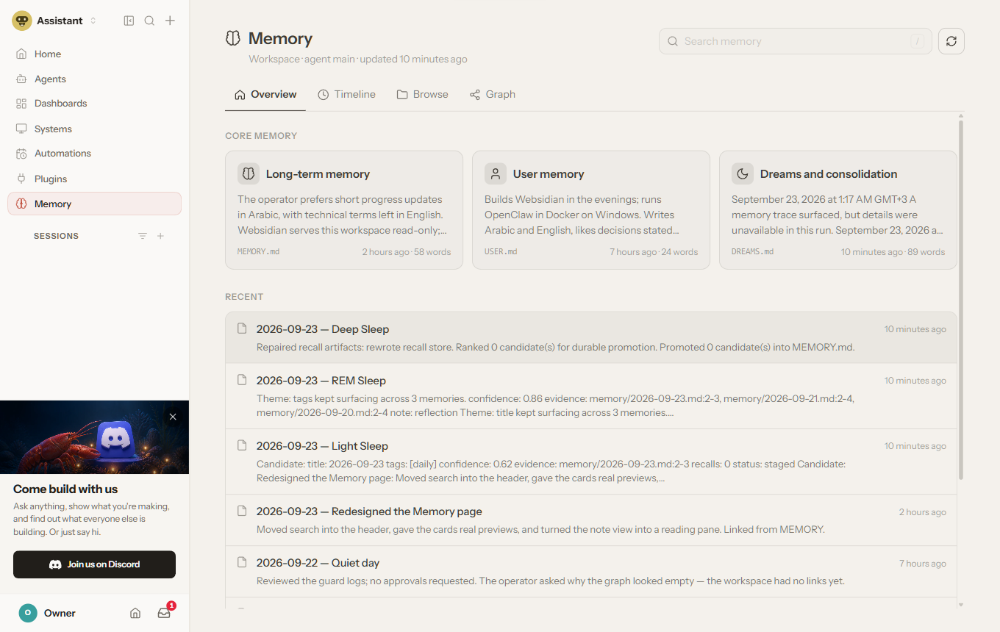

# Websidian

### Your Obsidian vault as a live web workspace.

**Browse it. Search it. Edit it. Publish it. Connect AI agents to it.**

Websidian turns an existing Obsidian or Markdown vault into a web workspace without moving the knowledge into another database or proprietary format.

Your Markdown files remain the source of truth.

Change a note in Obsidian, the browser editor, Git, Dropbox, `rsync`, or an AI agent — Websidian sees the same file and serves the updated version. There is **no content build step and no separate publish step**.


> **Your vault stays your vault.**  
> No import. No duplicated knowledge store. No vendor-specific database.  
> The files are the database; Git can remain the history.

## Why Websidian?

Obsidian is excellent when you are sitting at your desktop. A Markdown vault is also a useful source of documentation, operational knowledge and AI-agent memory.

Websidian adds the missing web layer.

| You want to… | Websidian gives you… |
|---|---|
| Read a vault from anywhere | A responsive documentation-style website |
| Find knowledge quickly | Full-text search, navigation, backlinks and local graphs |
| Edit without opening Obsidian | A CodeMirror 6 browser editor with Live Preview |
| Publish changing documentation | Pages rendered directly from the current Markdown |
| Keep private and public knowledge separate | Draft/publish controls, authentication and per-site configuration |
| Use Markdown with AI agents | Agent-aware security, protected instruction files and untrusted-content mode |
| Understand an agent's memory | OpenClaw and Hermes integrations over the same files |
| Embed knowledge in another product | Article-only and shell embedding modes |

## One vault, several ways to use it

### 📖 Read and publish

Point Websidian at a vault and it becomes a navigable website with folders, breadcrumbs, table of contents, backlinks, search, attachments and graphs.

There is no generated HTML tree to keep in sync. Pages are rendered from the current `.md` files and cached until they change.

### ✎ Edit from the browser

The optional browser editor writes back to the same Markdown files.

It includes Live Preview and Source modes, properties/frontmatter editing, table editing, `[[wikilink]]` suggestions, tags, attachments, hotkeys, quick switcher, command palette, conflict detection and RTL-aware editing.


### 🕸️ Explore the knowledge

Websidian provides both an Obsidian-style graph and an Explore view designed for understanding larger vaults.

Use local graphs while reading, open the global graph, group by folder, or explore relationships between sections.


### 🧠 See what your AI agent remembers

Websidian can also act as a transparent knowledge and memory layer for AI agents.

With the OpenClaw plugin, a native **🧠 Memory** page appears inside OpenClaw so you can inspect long-term memory, information the agent keeps about you, daily notes, search, timeline and graph — without creating a second copy of the files.



The same agent-oriented design is used for Hermes integration, protected instruction files and folders written by agents.

## Quick start

Requires **Node.js 20 or later**.

```bash
git clone https://github.com/satabd/Websidian.git
cd Websidian
npm install
cp websidian.config.example.json websidian.config.json
npm start
```

Open:

```text
http://127.0.0.1:8080/websidian/
```

The example configuration serves this repository's own documentation vault, so a fresh clone gives you something real to explore immediately.

To serve your vault, the important setting is simply its folder:

```json
{
  "sites": [
    {
      "slug": "notes",
      "title": "My notes",
      "root": "/path/to/your/obsidian/vault"
    }
  ]
}
```

Then:

```text
vault/guide/Start Here.md
        ↓
http://localhost:8080/notes/guide/Start%20Here
```

Need authentication, publishing rules, multiple vaults, branding, browser editing, agent security or webhooks? See the **full documentation** in [docs/Start Here.md](docs/Start%20Here.md).

## What works from Obsidian

Websidian is built around Obsidian-flavored Markdown rather than treating a vault as generic Markdown.

Supported features include:

- `[[wikilinks]]`, aliases, headings and block references
- images and attachments with Obsidian embeds
- note and section transclusion
- callouts, including nested and collapsible callouts
- tasks, highlights, comments and footnotes
- Mermaid diagrams
- KaTeX math
- YAML frontmatter and properties
- tags, backlinks and local graphs
- CSS classes and Obsidian snippets
- Excalidraw viewing
- Obsidian Bases rendered as sortable table views
- multilingual notes and language switching
- mixed Arabic/English and other RTL content
- standard Markdown links in addition to Obsidian links

Websidian also reads relevant settings from `.obsidian/app.json` for the editor so the browser experience can follow the vault's own preferences.

Current limitations include Dataview queries, non-table Bases views, LaTeX inside Excalidraw drawings and Canvas files.

For the detailed compatibility matrix, see the documentation vault: [docs/Start Here.md](docs/Start%20Here.md).

## OpenClaw: make agent memory visible

Websidian is available on ClawHub as **websidian**.

```bash
openclaw plugins install clawhub:websidian --accept-capabilities
openclaw config set gateway.controlUi.experimental.customPlugins true
openclaw config set plugins.entries.websidian.hooks.allowConversationAccess true
openclaw gateway restart
```

With the default configuration, the plugin serves the default agent workspace read-only and adds a native **🧠 Memory** destination to the OpenClaw Control UI.

You can then inspect:

- `MEMORY.md`
- `USER.md`
- `DREAMS.md`
- dated memory notes
- recent changes
- search results
- the vault graph
- individual notes rendered by Websidian

The plugin can also add links to notes the agent creates and protect important instruction files such as `SOUL.md`, `AGENTS.md`, `MEMORY.md` and `USER.md` from silent modification.

**ClawHub:** [clawhub.ai/satabd/plugins/websidian](https://clawhub.ai/satabd/plugins/websidian)

**Full OpenClaw reference:** [integrations/openclaw/websidian/README.md](integrations/openclaw/websidian/README.md)

## Hermes Agent: a second-brain workspace inside the dashboard

Websidian also has a native integration for **Hermes Agent**.

Instead of treating Hermes memory, skills and project notes as files you have to inspect from the shell, the plugin adds a **Websidian** workspace to the Hermes dashboard.

From one place you can work with:

- **Overview** — memory status, configured vaults and recently changed notes
- **Memory** — `MEMORY.md` and `USER.md` as readable entries, including their configured size limits
- **Skills** — browse and search Hermes skills and their `SKILL.md` files
- **Browse** — navigate any configured Obsidian or Markdown vault
- **Graph** — explore how notes connect
- **Ask** — optionally talk to Hermes Agent, Claude Code or Codex about the note you are reading
- **Deep links** — links from Hermes replies can open the exact note inside the dashboard

The integration is not only a viewer. It also adds safeguards around the files that shape the agent.

When Hermes tries to change protected instruction or memory files such as `SOUL.md`, `AGENTS.md`, `MEMORY.md`, `USER.md` or `SKILL.md`, Websidian can route that change through Hermes's own human-approval flow or block it entirely.

Agent-written vault content is also checked before it is written: active HTML and dangerous browser content are refused, and agent-facing vaults default to Websidian's `untrusted` mode.

The plugin also adds:

- a `websidian_links` tool
- a `/brain [query]` command for recent notes
- **Notes updated:** links after Hermes writes notes
- a Websidian skill for writing vault-compatible notes
- an install/update skill that Hermes itself can follow
- multi-vault support for a second brain, memories, skills and project knowledge

### Install the Hermes integration

The Hermes plugin lives inside this repository, so install it from the repository checkout:

```bash
bash integrations/hermes/websidian/deploy/install-local.sh
hermes plugins enable websidian
```

On Windows, use:

```powershell
powershell -ExecutionPolicy Bypass -File integrations\hermes\websidian\deploy\install-local.ps1
```

Restart the **Hermes dashboard** to load the Websidian dashboard extension, and restart the **Hermes gateway** for the write guard and reply links to become active.

The installer keeps the Websidian runtime under the Hermes profile and performs a health check before it finishes. Browser editing is opt-in per vault; agent-facing vaults default to `untrusted: true`.

**Hermes integration reference:** [integrations/hermes/websidian/README.md](integrations/hermes/websidian/README.md)

**Hermes guide:** [docs/01 Guide/Hermes plugin.md](docs/01%20Guide/Hermes%20plugin.md)

## AI without turning the vault into an AI database

Websidian deliberately keeps the Markdown files at the center.

### Writing help

The editor can optionally send selected text to Claude CLI, Hermes CLI or an API backend for actions such as improve, shorten, expand, summarize, translate or suggest a title.

Nothing is written until you save.

See [Writing help](docs/01%20Guide/Writing%20help.md).

### Agents in the editor

An optional **Agents** panel lets Claude Code, Codex, Hermes Agent or OpenClaw work with the note you are viewing.

Agents can be configured independently for review or edit workflows, and changes can be inspected as diffs.

See [Agents in the editor](docs/01%20Guide/Agents%20in%20the%20editor.md).

### Content written by agents is treated differently

Agent-generated notes may contain text copied from websites, tools or other untrusted sources.

For those vaults, `"untrusted": true` enables a hardened mode that disables active raw HTML, restricts attachments, applies a strict Content Security Policy and uses strict Mermaid rendering.

This allows you to make agent knowledge readable without assuming everything the agent wrote is safe browser content.

## Your files remain portable

Websidian does not require a special knowledge schema.

A Websidian vault is still an ordinary folder of Markdown files that can be opened with:

- Obsidian
- a text editor
- Git
- another Markdown tool
- scripts and automation
- AI coding/agent tools

If Websidian is removed, the knowledge remains.

This also means you can improve the web experience without making the vault dependent on Websidian.

## Publishing model

A request is served from the Markdown file itself.

When a note changes, Websidian invalidates the relevant cached page and renders it again. Browsers receive normal ETags and caches, and a disk cache can survive server restarts.

Typical workflows are therefore simple:

```text
Obsidian save
     │
     └──▶ Websidian sees changed Markdown ──▶ next visitor sees it
```

or:

```text
git push ──▶ server git pull ──▶ Websidian rescans ──▶ updated site
```

Websidian includes an optional Git webhook for the second workflow.

## Search, navigation and graphs

Navigation is derived from the vault rather than maintained as a second manual structure.

Websidian supports:

- generated folder/section pages
- configurable reading order
- previous/next navigation
- backlinks
- fuzzy and prefix search
- highlighted search snippets
- local graphs on linked notes
- global graph view
- Explore view with folder clusters and path finding
- multiple vaults from one server

See [Navigation and sections](docs/01%20Guide/Navigation%20and%20sections.md) and [Graph and Explore](docs/01%20Guide/Graph%20and%20Explore.md).

## Embed Websidian in another application

Two modes are designed for integration:

```text
?embed=1   article only
?shell=1   navigation + search + reading experience, without Websidian's outer header
```

That makes it possible to place a note, a documentation area or a complete knowledge browser inside another application.

This is also how Websidian can sit naturally inside agent dashboards instead of feeling like a separate product.

## Security and control

Websidian can serve public documentation, private knowledge or agent-generated material, but those cases should not share the same trust assumptions.

Important controls include:

- per-site authentication
- optional browser editing
- editor IP/network allowlists
- read-only vaults
- draft and publish filtering
- protected agent instruction files
- `untrusted` mode for agent-written content
- strict path handling
- rate limiting for search and login
- proxy authentication for trusted host applications
- CSP hardening for untrusted sites
- sensitive dot-folders such as `.git`, `.obsidian` and `.trash` never served directly

Keep secrets in the Websidian configuration, outside the vault and outside version control. Use HTTPS when exposing a site beyond a trusted local network.

For the full security and configuration reference, start at [docs/Start Here.md](docs/Start%20Here.md).

## Deployment

### Node

```bash
npm ci --omit=dev
npm start
```

Put nginx, Caddy or another reverse proxy in front for HTTPS.

### Docker

```bash
docker compose up -d
```

Mount the vault read-only when you only need publishing. Mount it writable if you intentionally enable browser editing.

The vault can be kept current through Git, Dropbox, Obsidian Sync, `rsync` or any other mechanism that updates the Markdown files on disk.

## Documentation

The project's full documentation is itself an Obsidian vault under [`docs/`](docs/Start%20Here.md).

Good starting points:

- [Start Here](docs/Start%20Here.md) — choose a path through the documentation
- [Navigation and sections](docs/01%20Guide/Navigation%20and%20sections.md)
- [Graph and Explore](docs/01%20Guide/Graph%20and%20Explore.md)
- [Excalidraw drawings](docs/01%20Guide/Excalidraw%20drawings.md)
- [Writing help](docs/01%20Guide/Writing%20help.md)
- [Agents in the editor](docs/01%20Guide/Agents%20in%20the%20editor.md)
- [OpenClaw plugin](docs/01%20Guide/OpenClaw%20plugin.md)
- [Hermes plugin](docs/01%20Guide/Hermes%20plugin.md)

You can also run:

```bash
npm run demo
```

and browse the documentation through Websidian itself.

## For operators and contributors

The detailed configuration keys, endpoints, cache behavior, editor API, proxy authentication, test layout and implementation notes live in the documentation rather than being duplicated here.

Run the complete test suite with:

```bash
npm test
```

The repository includes tests for rendering, vault indexing, links, search, authentication, hardening, caching, editor behavior, graph data, Excalidraw, Bases, proxy authentication, server routes, and the OpenClaw and Hermes integrations.

## From md2html

Websidian was originally called **md2html**. Existing configuration, environment-variable and cookie names that use the old name are still accepted for compatibility.

New installations should use the Websidian naming and documentation.

## Philosophy

Websidian is intentionally not another place where your knowledge has to live.

It is a web interface over knowledge you already own.

```text
                 ┌───────────────┐
Obsidian ───────▶│               │──────▶ Website
Git ────────────▶│   Markdown    │──────▶ Browser editor
Dropbox ────────▶│     vault     │──────▶ Search / Graph
AI agents ──────▶│               │──────▶ Agent memory UI
                 └───────────────┘
```

One set of files. Multiple ways to work with them.

## License

MIT.
