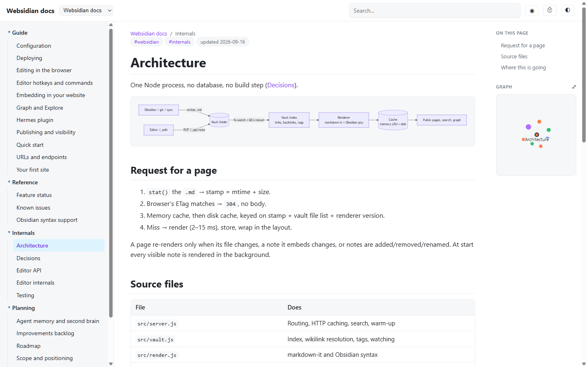
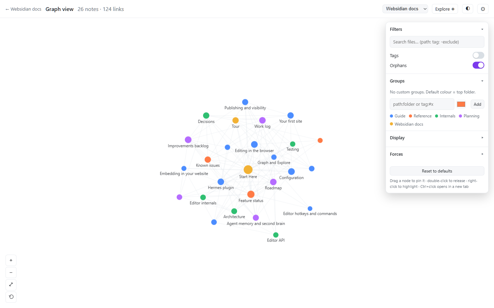
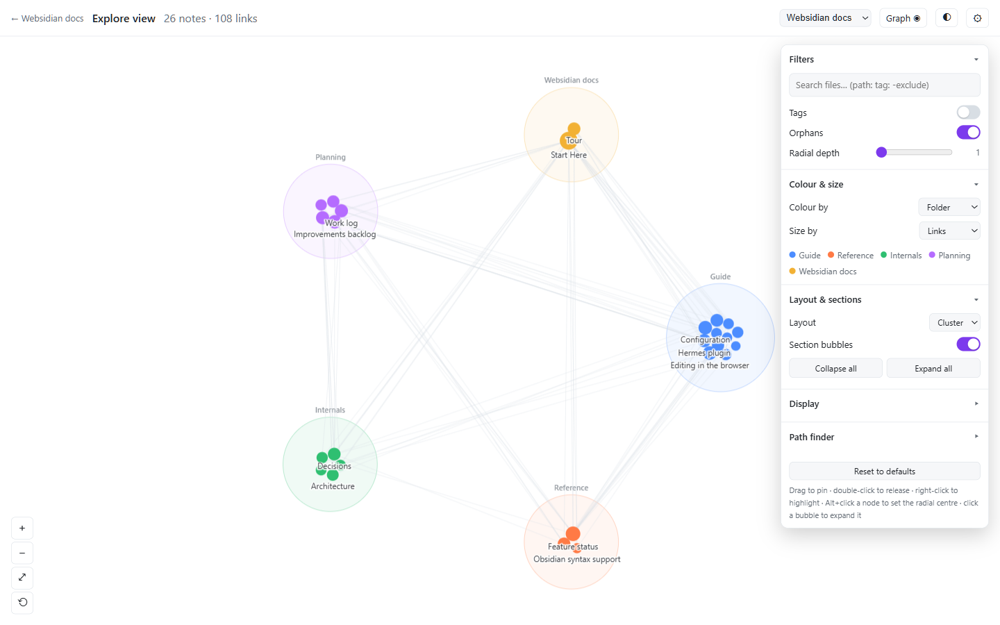
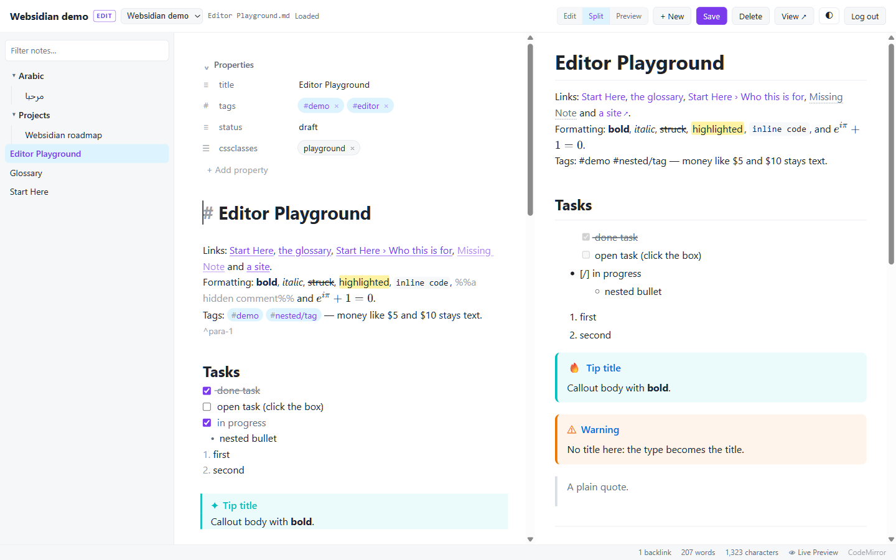

# Websidian — your Obsidian vault as a website you can edit from anywhere

*(formerly md2html; the config file, env var and cookie names still accept the old names. See [ROADMAP.md](ROADMAP.md) for where this is going.)*

**Full reference:** the Obsidian vault in [`docs/`](docs/Start%20Here.md) — open the folder in Obsidian, or run `npm run demo` and browse <http://127.0.0.1:8093/websidian/>. It covers usage, hotkeys, feature status, known issues, internals and the improvements backlog, and is updated as the project changes.



Point it at one or more Obsidian vaults and it serves them as a documentation
site. Pages are rendered from the `.md` files **on request** and cached until
the file changes. To update the website you edit the Markdown — in Obsidian,
by `git pull`, by Dropbox sync, by `rsync` — and the next visitor sees the new
version. There is no build step and no publish step.

```
vault/00-overview/Start Here.md   →   https://docs.example.com/odoohms/00-overview/Start%20Here
```

## Quick start

```bash
npm install
cp websidian.config.example.json websidian.config.json
npm start          # http://127.0.0.1:8080/websidian/
```

The example config serves this project's own documentation vault (`docs/`), so a
fresh clone has something real to look at straight away. Point `root` at your own
vault when you are ready.

`websidian.config.json` describes the sites (`md2html.config.json` still works):

```json
{
  "port": 8080,
  "cacheDir": ".cache",
  "warm": true,
  "sites": [
    {
      "slug": "notes",
      "title": "My notes",
      "root": "/path/to/your/obsidian/vault",
      "home": "00-overview/Start Here",
      "exclude": ["Private", "*.base", "*.xlsx"],
      "folderNames": { "ar": "العربية" },
      "codeLinks": { "base": "https://github.com/you/your-repo/blob/main/", "vaultPathInRepo": "docs" }
    }
  ]
}
```

| Key | Meaning |
|---|---|
| `slug` | URL prefix: `/odoohms/...` |
| `root` | Vault folder (absolute, or relative to the config file) |
| `home` | Note shown at `/slug/`. Falls back to `index`, `home`, `readme`, `start here`, then the first note |
| `exclude` | Folders (by path) or extensions (`*.xlsx`) to ignore. `.obsidian` and other dot-folders are always ignored |
| `excludeStatus` | e.g. `["draft"]` — notes whose frontmatter `status` matches are not served or listed |
| `onlyPublished` | `true` → only notes with `publish: true` in frontmatter are served. `publish: false` always hides a note |
| `folderNames` | Display names for folders in the sidebar (`10-presentation` becomes "Presentation" automatically) |
| `codeLinks` | Rewrites relative links that leave the vault (`../../addons/x.py:221`) to your repository (`…/addons/x.py#L221`) |
| `auth` | Restrict a site: `{ "users": { "name": "password" } }` for a browser login prompt (HTTP Basic), and/or `{ "token": "secret" }` for share links (`…/odoohms/?token=secret` sets a cookie for 30 days). Protected sites are `noindex` and excluded from robots/sitemap |
| `snippets` | Vault CSS snippets from `.obsidian/snippets` to include on every page: `true` (default, the ones enabled in Obsidian; `false` by default on `untrusted` sites), `"all"`, `["name", …]`, or `false` |
| `webhook` | `{ "secret": "…", "command": "git pull --ff-only" }` enables `POST /_hooks/git/<slug>` (GitHub signature or `?token=`) which runs the command in the vault folder and rescans |
| `edit` | Browser editor for the site's notes (see [Editing in the browser](#editing-in-the-browser)): `{ "users": { "name": "password" }, "allowFrom": ["10.0.0.0/8"], "token": "…", "sessionHours": 12, "secret": "…", "protect": ["SKILL.md"], "memoryLimits": { "MEMORY.md": 2200 } }` (`protect`/`memoryLimits`: see agent instruction files). Top-level applies to all sites; per site overrides it; `false` on a site turns it off. Without `edit`, no editor URLs exist |
| `brand` | Per-site look: `name`, `logo` (URL), `color` (accent), `font`, `favicon`, `homeUrl` (where the brand link goes), `backLink: {label, url}` (link back to your product page), `footer` (HTML), `headHtml` (analytics etc.), `css` (extra rules) |
| `untrusted` | `true` for a folder whose notes you did not write yourself, e.g. written by an AI agent: no raw HTML in notes, only images/PDF/audio/video served as attachments, a strict Content-Security-Policy and strict mermaid. See [Serving folders written by AI agents](#serving-folders-written-by-ai-agents) |
| `basePath` | Top-level. Mount everything under a prefix, e.g. `"/docs"` → `yoursite.com/docs/odoohms/…` behind a reverse proxy |
| `publicUrl` | Top-level, e.g. `https://docs.example.com`. Makes sitemap, canonical and OpenGraph URLs absolute |
| `adminToken` | Top-level. Enables `POST /_purge[?site=x]` with `Authorization: Bearer <token>`: clears memory + disk cache and rescans |
| `log` | Top-level: `"text"` (default), `"json"` (one JSON object per line for log shippers), or `false` |
| `cache.maxEntries` | Top-level. LRU cap for the in-memory cache (default 2000 pages); evicted pages come back from disk without re-rendering |
| `rateLimit.search` | Top-level. Search requests per minute per IP (default 60). `rateLimit.login` does the same for editor sign-in attempts and failed `auth.users` logins (default 10) |
| `trustProxy` | Top-level. Set `true` behind nginx/Caddy so rate limiting sees real client IPs |
| `proxyAuth` | Top-level. Sign-in by a trusted reverse proxy that has its own login: `{ "secret": "<random, ≥ 32 chars>", "secretHeader": "x-websidian-proxy-secret", "userHeader": "x-websidian-user", "allowFrom": ["127.0.0.1", "::1"] }` (all but `secret` optional, these are the defaults). A request from `allowFrom` carrying the secret passes the site `auth` and is signed in to the editor as `userHeader`. See [Behind a trusted proxy](#behind-a-trusted-proxy-eg-the-hermes-dashboard) |
| `port`, `host` | Also settable with `PORT` / `HOST` env vars. `MD2HTML_CONFIG` points to another config file |
| `cacheDir` | Disk cache location, `false` for memory-only. `diskCache: false` also disables it |
| `warm` | Pre-render every note in the background at start-up (213 notes take ~0.4 s) |

Add more vaults by adding entries to `sites`. With more than one site `/` shows an index and the header gets a site switcher.

## What Obsidian syntax is supported

| Syntax | Result |
|---|---|
| `[[Note]]`, `[[Note\|alias]]`, `[[Note#Heading]]`, `[[folder/Note]]` | Links resolved like Obsidian (by name, shortest path wins, same folder preferred). Unresolved links are shown dashed, never broken |
| `![[image.png]]`, `![[image.png\|300]]`, `![[image.png\|300x200]]` | Images from anywhere in the vault, lazy-loaded |
| `![[Note]]`, `![[Note#Section]]` | Transclusion (rendered inline, 3 levels deep). The page is re-rendered when the embedded note changes too |
| `![[file.pdf]]`, video, audio, other files | Inline viewer / player / download link |
| `> [!tip] Title`, `> [!question]- folded`, `> [!warning]+ open`, nested callouts, all Obsidian types and aliases | Styled callouts with Obsidian's colours; `-`/`+` become collapsible `<details>` |
| ```` ```mermaid ```` | Diagrams rendered in the browser (mermaid 11, served locally, theme-aware) |
| `==highlight==`, `%%comment%%`, `- [ ]` / `- [x]` | Mark, hidden, checkboxes |
| `^block-id` on a paragraph, list item or after a table; `[[Note#^id]]`, `![[Note#^id]]` | Block anchors, links and block transclusion |
| `[^1]` footnotes, `$inline$` and `$$display$$` math | Footnotes with back-links; math rendered by KaTeX (served locally, loaded only on pages that need it) |
| `![[Drawing.excalidraw]]` | Shows the plugin's auto-exported `.svg`/`.png` next to the drawing (enable auto-export in the Excalidraw plugin); the drawing note itself is never a page |
| `Catalogue.base` (Obsidian Bases) | Rendered as sortable tables: filters (`and`/`or`/`not`, `file.inFolder`, `file.hasTag`, `prop == "x"`, `prop.contains()`…), formulas (`if()`, `==`, `+`, `&&`…), table views with `order`, `groupBy`, `sort`, `limit`, `displayName` labels. Cards/other view types are skipped |
| `cssclasses:` frontmatter and `.obsidian/snippets/*.css` | Classes applied to the page; the snippets enabled in Obsidian are served with the site, so brochure/print styling carries over |
| `translation:` / `translations:` frontmatter, or two notes with different `lang` linking to each other | Language switch in the header |
| YAML frontmatter | `title` used everywhere, `lang: ar` → right-to-left page, `status`/`tags`/`audience`/`updated` shown as chips, `description` → meta tag |
| Tables, code fences, footnote-free GFM, raw HTML (`<br>`, `<div class="page-break">`) | As in Obsidian's reading view; single newlines are line breaks (Obsidian default) |
| Standard `[text](Other Note.md)`, `` links | Also resolved |

Not supported: Dataview queries, Bases views other than tables, Excalidraw drawings without an exported image, Canvas files.

## URLs

| URL | Serves |
|---|---|
| `/odoohms/` | Home note |
| `/odoohms/10-presentation/Scenario 1 - Patient Registration` | That note |
| `/odoohms/Scenario 1 - Patient Registration` | Redirects (301) to the canonical URL above — bare names work like wikilinks |
| `/odoohms/screenshots/x.png` | Any attachment straight from the vault |
| `/odoohms/00-overview/Glossary?raw` | The Markdown source |
| `/odoohms/_search?q=insurance claim` | JSON search across the vault (the header search box uses it) |
| `/odoohms/00-overview/Glossary?embed=1` | **Embed mode**: the article only (no header, sidebar, search), for an iframe or include in your own website. Links inside stay in embed mode |
| `/odoohms/_edit/00-overview/Glossary` | **Editor** for that note (only when `edit` is configured and you are signed in; see below). `/odoohms/_edit/` opens the home note |
| `/odoohms/Catalogue.base` | An Obsidian Base rendered as tables (also listed in the sidebar) |
| `/odoohms/_graph`, `/odoohms/_graph?focus=<rel>` | **Graph view**: Obsidian's graph on the web — filters, colour groups, forces, local graph, pinning. [Full reference](docs/01%20Guide/Graph%20and%20Explore.md) |
| `/odoohms/_explore`, `/odoohms/_explore?focus=<rel>` | **Explore view**: a second graph built for reading — folder clusters, section bubbles, radial rings, a path finder between any two notes. [Full reference](docs/01%20Guide/Graph%20and%20Explore.md) |
| `/odoohms/_graph.json?rel=<rel>&depth=1&tags=1` | The graph data (ETagged; built from the index, no rendering). Nodes carry `links`, `in`, `out`, `status`, `updated`, `dist`; the result carries per-section `clusters` and cross-section `clusterLinks` |
| `/odoohms/sitemap.xml`, `/robots.txt` | For search engines; protected sites are excluded |
| `/_health` | Liveness: `{ ok, uptimeSec, sites: [...] }` |
| `/_stats` | Cache hit/miss counters, search index state, snippets, auth flags |
| `POST /_purge?site=x` | Clear caches and rescan (needs `adminToken`) |
| `POST /_hooks/git/odoohms` | Git webhook: pull and rescan (needs the site's `webhook.secret`) |

Every page ends with **Previous / Next** (within its folder) and **Linked from** (backlinks), computed from the index so they are always current. Every linked note also shows a **local graph** (the note and its neighbours) in the right column, and the ◉ button opens the full graph focused on that note. The header has a **language switch** when another edition of the note exists, a **print / PDF** button, and **search** with fuzzy and prefix matching, title boosting and highlighted snippets (MiniSearch index, rebuilt automatically when notes change).





## Keeping the server's vault current with a git webhook

On GitHub: repository Settings → Webhooks → Add: payload URL `https://docs.example.com/_hooks/git/odoohms`, content type `application/json`, secret = the site's `webhook.secret`, event "Just the push event". Every push then runs `git pull --ff-only` in the vault folder on the server and rescans; the next request serves the new content. Without GitHub, any system can call `POST …/_hooks/git/odoohms?token=<secret>`.

## Editing in the browser



Viewing is public; editing is a separate surface that only exists when you configure it, so the same server can be your public website and your team's editor.

```json
"edit": { "users": { "sat": "a-long-password" }, "allowFrom": ["10.0.0.0/8", "::1"] }
```

- **Own URLs** — `/odoohms/_edit/<note>` is the editor, `/odoohms/_api/…` its JSON API. Nothing else changes: public pages, embeds, search and the sitemap are untouched.
- **Own login** — `edit.users` accounts sign in at `/odoohms/_edit/_login` and get a signed, `HttpOnly`, `SameSite=Strict` session cookie (default 12 hours, `sessionHours`). Sessions are invalidated on restart unless you set `edit.secret`. Sign-in attempts are rate limited.
- **Own network gate** — `edit.allowFrom` (IPs, prefixes like `"192.168."`, or IPv4 CIDRs) hides the editor entirely from everyone else: they get 403, and never see an Edit button. Set `trustProxy` when behind nginx/Caddy so the client IP is the real one.
- **Scripts** — `edit.token` allows `Authorization: Bearer <token>` on the API without a browser session, e.g. `curl -X PUT -H 'X-Requested-With: cli' -H 'Content-Type: application/json' -d '{"rel":"a/b.md","text":"…","stamp":null}' …/_api/note`.
- **Agent instruction files** — on `untrusted` sites, `SKILL.md`, `SOUL.md`, `AGENTS.md`, `MEMORY.md`, `USER.md`, `TOOLS.md`, `IDENTITY.md`, `HEARTBEAT.md` and `BOOTSTRAP.md` (any folder, any case) are what an AI agent reads as instructions, so the editor shows a warning banner on them and saving or deleting asks for confirmation (the API answers `428` until the request carries `"confirm": "instructions"`, or `?confirm=instructions` on DELETE). Autosave never confirms. `edit.protect` replaces the list on any site (file names or globs like `"prompts/**"`; `[]` turns it off). `memories/MEMORY.md` and `memories/USER.md` (Hermes Agent's memory) also warn when over their character budget, `edit.memoryLimits` (default `{ "MEMORY.md": 2200, "USER.md": 1375 }`).

Once signed in, every page shows a **✎ Edit** button. The editor lists every note in the sidebar, including drafts and unpublished ones. Notes are written atomically and the page, search index and navigation update immediately. If the file changed on disk since you opened it (edited in Obsidian on the desktop, synced, pulled), saving stops with a conflict banner: reload the disk version or overwrite it. **Delete** moves the note to the vault's `.trash` folder, like Obsidian; nothing is ever destroyed. Line endings of existing files are preserved.

**Try it without touching a real vault:** `npm run demo` serves the small vault in `demo/vault` at <http://127.0.0.1:8093/demo/> (only from this machine). Sign in as `demo` / `demo` and open **Editor Playground**, which exercises every feature below.

### The editor: CodeMirror 6, like Obsidian

The note editor is built on **CodeMirror 6**, the engine Obsidian itself uses, and is set up to feel like Obsidian:

- **Live Preview and Source mode** (toggle in the status bar). Live Preview hides Markdown syntax except where the cursor is, and renders links, `[[wikilinks]]` (`Note › Heading`), checkboxes you can click, bullets, callouts with their icon and colour, images and `![[embeds]]` (with `|300` / `|640x480` sizes), inline and block math (KaTeX), mermaid diagrams, horizontal rules and code blocks with language highlighting. A plain click on a link puts the cursor in it to edit; **`Ctrl`/`Cmd`+click follows it** (`Ctrl+Shift`+click or middle click: new tab). Missing notes open as new ones, as in Obsidian.
- **Tables are edited as a grid**, like Obsidian: click a cell to edit its Markdown in place, `Tab`/`Shift+Tab` and `Enter` move between cells (and add a row at the end), `Shift+Enter` inserts `<br>`, `Esc` leaves. A toolbar on hover adds/removes rows and columns, aligns a column, or switches to the table's Markdown. Only the edited cell changes in the file.
- **Properties panel** for the frontmatter: text, dates, numbers, checkboxes, and lists as pills (tags, aliases…) with suggestions from the vault; add, rename or remove properties, or `</>` to edit the YAML. Types come from `.obsidian/types.json` when present, otherwise from the values; `propertiesInDocument` (visible / hidden / source) is honoured. Only the edited property changes in the file.
- **Right-to-left**: every line, table cell and property takes its direction from its own text, so Arabic and English sit side by side; code and math stay left-to-right.
- **Obsidian Flavored Markdown is parsed, not guessed**: wikilinks, embeds, `==highlight==`, `%%comments%%`, `$math$`/`$$math$$`, `#tags`, `^block-ids`, footnotes, callouts, tasks with any status character (`- [/]`), YAML frontmatter.
- **Suggestions**: `[[` notes, aliases and attachments (fuzzy); `[[note#` headings; `[[note#^` block ids; `![[` files first; `#` tags from the whole vault; property names and values inside frontmatter; `/` slash commands (callouts, tables, code/math blocks, mermaid, headings, lists, date/time…).
- **Obsidian's hotkeys**: `Ctrl+B`/`I` bold/italic, `Ctrl+K` Markdown link, `Ctrl+L` toggle checkbox, `Ctrl+/` comment, `Ctrl+D` delete paragraph, `Ctrl+]`/`[` indent, `Alt+Enter` follow link, `Ctrl+F`/`H` search and replace, `Ctrl+E` reading view, **`Ctrl+O` quick switcher** (Shift+Enter creates), **`Ctrl+P` command palette** (every command above, recently used first), `Ctrl+S` save, `Ctrl+Alt+N` new note. Lists continue on Enter, Tab indents list items, brackets and backticks auto-pair, typing `*` `=` `~` `` ` `` `$` `%` over a selection wraps it, pasting a URL over a selection makes a link, `Alt`+click adds a cursor.
- **Reads the vault's `.obsidian/app.json`**, so it behaves as the vault owner configured Obsidian: tabs vs spaces and tab size, auto-pair brackets/Markdown, smart lists, Live Preview default, readable line length, line numbers, spellcheck, fold headings, right-to-left, new link format (shortest / relative / absolute, or Markdown links), and where new notes go. Frontmatter `cssclasses` apply to the editor too. Arabic and English lines each get their own direction.
- **Obsidian's DOM and class names**: lines carry `HyperMD-header-2`, `HyperMD-list-line`, `HyperMD-codeblock`, `HyperMD-quote`, `HyperMD-task-line[data-task]`…; tokens `cm-formatting-*`, `cm-hmd-internal-link`, `cm-hashtag`, `cm-strong`…; widgets `task-list-item-checkbox`, `internal-embed`, `list-bullet`; the host `.markdown-source-view.mod-cm6.is-live-preview`; the palette `.prompt` / `.suggestion-item`. Styles read Obsidian's CSS variables (`--text-normal`, `--h1-size`, `--tag-background`…), so Obsidian themes and snippets written for the editor apply.
- The status bar shows backlinks, words and characters (of the selection too) and the mode. **Split** shows the page as the site renders it next to the editor; **Preview** is the reading view. **Autosave** (2 s after you stop typing) is available in the command palette, off by default, because every save publishes.

No build step: the server serves CodeMirror's ES modules straight from `node_modules` at versioned URLs (`/_vendor/esm/<package>@<version>.js`, cached as immutable) and writes an import map into the editor page. The editor's own modules live in `public/cm/`. Browsers without import maps, or `?textarea=1`, get the plain textarea editor with the same save, preview and `[[` suggestions.

API, all under `/<slug>/_api/` (JSON, `X-Requested-With` header required on writes): `GET note?rel=` → `{text, stamp}`, `PUT note {rel, text, stamp}` (`stamp: null` creates; a stale stamp answers `409`), `DELETE note?rel=`, `POST preview {rel, text}`, `GET notes` (with aliases), `GET files` (attachments), `GET tags` (with counts), `GET properties` (names, types, common values), `GET anchors?rel=` (headings and `^block` ids). Only `.md` notes inside the vault can be touched; dot-folders and `exclude`d paths are refused.

The vault must be writable by the server process (in `docker-compose.yml` mount it `rw` instead of `ro`). Because edits are ordinary file writes, whatever syncs the vault (git, Dropbox, Obsidian Sync) carries them back to your desktop; with a git-backed vault commit on the server as you would after any change.

### Behind a trusted proxy (e.g. the Hermes dashboard)

When Websidian is reached only through another application that already signs its users in (the Hermes Agent dashboard's plugin backend proxies it at `/api/plugins/websidian/w/…`), that application can sign requests in for it, so nobody logs in twice:

```json
"basePath": "/api/plugins/websidian/w",
"host": "127.0.0.1",
"proxyAuth": { "secret": "<random, at least 32 characters>" },
"edit": { "allowFrom": ["127.0.0.1", "::1"], "secret": "<another random string>" }
```

The proxy adds `X-Websidian-Proxy-Secret: <secret>` and `X-Websidian-User: <name>` to every request it forwards. A request whose socket address (or `req.ip` with `trustProxy`) matches `proxyAuth.allowFrom` (default `127.0.0.1`, `::1`, including `::ffff:127.0.0.1`) **and** whose secret matches (constant-time) passes the site's `auth` without Basic auth or a token, and counts as signed in to the editor as that user: characters other than letters, digits, space and `._@-` are dropped, at most 64, `proxy` when empty. No login page and no session cookie are involved; the editor still needs `edit` configured (it may have no `users` or `token` when `proxyAuth` is valid) and still applies `edit.allowFrom`, `X-Requested-With` on writes and the agent-instruction-file confirmation. The editor's login page on such a site says sign-in happens through the proxy, and the editor shows no Log out button. A wrong secret, or the right one from another address, gives no privileges (the request falls back to normal auth) and is logged as `proxy-auth-denied`, without the secret. A `secret` shorter than 32 characters disables `proxyAuth` with a warning at start-up.

- **Bind Websidian to `127.0.0.1`** (`host`), so only processes on the same machine or container can reach it; the server warns when `proxyAuth` is on and it listens elsewhere.
- **Anyone who can reach the port and knows the secret is an editor**, under any name they choose. The proxy should strip client-supplied `X-Websidian-*` headers, but Websidian does not rely on it: the secret is the gate.
- **Keep the secret out of the vault** (and out of version control): an agent that can write the vault must not be able to read it. Keep `trustProxy` off unless another proxy sits in front, otherwise `X-Forwarded-For` decides the address that `allowFrom` checks.

## Serving folders written by AI agents

Websidian is a comfortable way to read what an agent (Hermes Agent, OpenClaw…) writes: its notes, memories, reports and skills. But an agent copies text from web pages and tool output into those files, so treat that text as written by a stranger. A note could contain a `<script>` that, opened by a signed-in editor, calls the editor API and rewrites the agent's instruction files. Mark such sites `"untrusted": true`:

```json
{ "slug": "agent", "root": "/home/me/agent-notes", "untrusted": true, "auth": { "users": { "me": "a-long-password" } } }
```

What changes on that site (other sites are untouched):

- **No raw HTML.** HTML in notes is shown as text, not run or rendered. Everything Obsidian-flavoured still works: callouts, wikilinks, embeds and transclusion, math, footnotes, block ids, mermaid, Bases, Excalidraw images. Frontmatter values are always escaped.
- **Only media attachments.** Images (png, jpg, gif, webp, avif, bmp, ico, svg), PDF, audio (mp3, m4a, ogg, wav, flac) and video (mp4, webm, mov, m4v) are served. Everything else — `.html`, `.json`, `.yaml`, `.env`, `.db`… — answers 404, so a stray `auth.json` or `state.db` in the folder is not published. SVGs are sent with a sandboxing CSP, so one opened directly cannot run script. `?raw` still returns a note's Markdown (and a `.base` as plain text).
- **Content-Security-Policy** on every page (reading view, embeds, graph, editor, login) with a fresh nonce per request: only the site's own scripts run, no inline scripts from content, no plugins, no `<base>` tricks, forms and fetches only to the site itself. `frame-ancestors` is not restricted, so embed mode keeps working in your own site's iframes. Scripts in `brand.headHtml` (your analytics) get the nonce automatically.
- **Mermaid in strict mode** (no HTML labels, no click callbacks), in the reading view and the editor preview.

All sites also send `X-Content-Type-Options: nosniff`.

Recommendations:

- **Point `root` at the folder of content you want to read**, never at the agent's whole state directory (`~/.hermes`, `~/.openclaw`): those hold API keys, session databases and configuration.
- **Use `auth`**, and bind to `127.0.0.1` or a Tailscale address (`"host"`) rather than the public internet: an agent's notes often contain private data.
- **`"edit": false`** on sites that hold the agent's instruction files (skills, `AGENTS.md`, memories) unless you really want to change them from the browser; if you do, keep `edit.allowFrom` narrow.
- Vault CSS snippets (`.obsidian/snippets`) are off by default on untrusted sites, because an agent could write them; set `"snippets": true` to use them anyway.

## Showing a note inside your own website

```html
<iframe id="doc" src="https://docs.example.com/odoohms/00-overview/What%20the%20System%20Does?embed=1"
        style="width:100%;border:0" title="What the System Does"></iframe>
<script>
  // The embedded page posts its height so the iframe can grow with the content.
  addEventListener('message', e => { if (e.data && e.data.type === 'md2html:height') document.getElementById('doc').style.height = e.data.height + 'px'; });
</script>
```

Or fetch the same URL server-side and inject the `<article>` into your template. Set `brand.color` and `brand.font` so the embedded typography matches your site, or `brand.css` for anything finer.

## How the caching works

```
request  ──▶ stat(note.md)  ──▶  ETag matches browser copy?  ──▶ 304 (no body)
                │                          no
                ▼
     memory cache keyed on  mtime + size + vault file-list hash + renderer version
                │ miss
                ▼
     disk cache (.cache/<site>/<sha1>.json)  ──▶ hit: load into memory
                │ miss
                ▼
     render Markdown (2–15 ms)  ──▶ store in both caches  ──▶ wrap in layout  ──▶ 200
```

- **A page is re-rendered only when its `.md` changes** (or a note it embeds changes, or a note is added/removed/renamed anywhere in the vault, which can change how wikilinks resolve). Detection is a `stat()` per request — microseconds, no content read.
- **Browsers cache too.** Every page carries a weak ETag built from the same stamp, with `Cache-Control: no-cache` (= always revalidate). A repeat visit is one small request answered with `304`.
- **Attachments** are served with `Last-Modified`/ETag and a one-hour `max-age`. CSS/JS/vendor libraries are immutable for 7–30 days (versioned URLs).
- **The disk cache survives restarts.** After a deploy the site is warm immediately; `/_stats` shows `diskHits`.
- **Watching.** The vault folder is watched (`fs.watch`, recursive) and re-indexed 400 ms after a change, with a 60 s periodic rescan as a safety net for synced folders (Dropbox, network shares).
- **Warm-up.** At start every visible note is rendered in the background so the first visitor never waits.

## Dynamic (this) vs. generating static HTML locally

| | Dynamic server (md2html) | Static generator (Quartz, MkDocs, Hugo…) |
|---|---|---|
| Publishing a change | Save the `.md`; next request serves it | Rebuild everything, then upload the output |
| What gets transferred to the server | Only the changed `.md` (git pull / rsync / Dropbox) | The whole built site, or a diff you manage yourself |
| Size on the server | Vault + a small JSON cache | Vault **and** a full copy as HTML |
| Rendering cost | Once per change, per page (2–15 ms), lazily | Every page, every build, even if unchanged |
| First-visit latency | Same as static: cached HTML (warmed at start) | Static file |
| Peak throughput | Thousands of req/s from memory cache; put nginx/Caddy in front for TLS and static-like caching | Slightly higher, any static host or CDN |
| Hosting requirement | A Node process (or the Docker image) | Any static host (GitHub Pages, S3, Netlify) |
| Search | Server-side, always current, no index to rebuild | Pre-built client index shipped with the site |
| Access control / drafts | Trivial: `excludeStatus`, `onlyPublished`, or basic-auth in nginx | Must not be built, or must be filtered at build time |
| Failure modes | Process must be running; a bad note only breaks its own page | Build fails as a whole; site stays on the old version until fixed |
| Best for | Docs that change often, many vaults, one place to keep up to date | Rarely changing content, no server to run |

If you ever need a static copy anyway (offline hand-over, CDN-only host), the renderer is the same code: a crawler over `/odoohms/` with `wget --mirror` produces one.

## Deploying

**Plain Node (pm2 / systemd):**

```bash
npm ci --omit=dev
MD2HTML_CONFIG=/etc/md2html/md2html.config.json PORT=8080 node src/server.js
```

Put nginx or Caddy in front for HTTPS, e.g. `reverse_proxy localhost:8080` in a Caddyfile.

**Docker:** `docker compose up -d` with the vault mounted read-only (see `docker-compose.yml`). The cache lives in a named volume.

**Keeping the vault current on the server:** whatever already syncs your Markdown works — a cron `git pull` in the vault folder, the Dropbox client, or `rsync` from your machine. Because the vault is in the OdooHMS repository under `docs/`, a `git pull` on the server is the whole deployment.

## Tests

```bash
npm test
```

Node's built-in test runner, no extra dependencies. `test/render.test.js` covers every Obsidian construct, `test/features.test.js` block references, footnotes, math, Excalidraw, translations, snippets and the layout, `test/bases.test.js` the Bases expression language and table rendering, `test/graph.test.js` the graph data and its layout hooks, `test/vault.test.js` the index and link resolution, `test/cache.test.js` both cache layers, `test/hardening.test.js` auth, rate limiting, LRU, SEO, webhook signatures and the search index, `test/cm-editor.test.js` the CodeMirror editor's own modules (Obsidian syntax parsing, link resolution and link format, editing commands, suggestions) loaded straight into Node, `test/editor.test.js` the editor's login, gates, API, import map and module serving, `test/proxy-auth.test.js` trusted-proxy sign-in and a deep `basePath` mount, and `test/server.test.js` + `test/server-ops.test.js` start the real server on scratch vaults and check routing, ETags, embed mode, auth, sitemap, snippets, bases, purge and the git webhook over HTTP.

## Security notes

Keep your config file (`websidian.config.json` or `md2html.config.json`) outside the vault and out of version control when it holds passwords, tokens or webhook secrets — both names are in `.gitignore`. Token links grant access to anyone who has the link. The vault is trusted content: raw HTML in notes is passed through, as Obsidian does. Only publish vaults you author. Path traversal is blocked, dot-folders (`.obsidian`, `.git`, `.trash`) are never served, and hidden/draft notes return 404 even by direct URL. The editor is opt-in (`edit`), lives on its own URLs behind its own login and optional IP allowlist, only ever writes `.md` files inside the vault, and never deletes (notes go to `.trash`). Use HTTPS in front of it: the session cookie is marked `Secure` when the request arrives over TLS.

Failed `auth.users` (HTTP Basic) logins are rate limited per client IP (`rateLimit.login`, default 10 a minute, then `429` with `Retry-After`); successful requests do not use up the budget. The editor refuses to write, create or trash a note through a symlink or Windows junction that leads outside the vault (the real path of the target's folder must be inside the vault's real root), and never writes through a note that is itself a link.

## Project layout

```
src/server.js   routing, HTTP caching, search, warm-up
src/vault.js    vault index, wikilink resolution, folder watching
src/render.js   markdown-it + Obsidian syntax plugins
src/layout.js   page shell: sidebar, breadcrumbs, TOC, metadata chips
src/cache.js    memory (LRU) + disk render cache
src/auth.js     per-site basic auth / share token
src/proxyauth.js  proxyAuth: sign-in by a trusted reverse proxy (shared secret + address)
src/search.js   MiniSearch index and snippets
src/bases.js    Obsidian Bases: expressions, filters, table views
src/seo.js      sitemap, robots, canonical/OpenGraph tags
src/hooks.js    purge endpoint and git webhook
src/editor.js   browser editor: login, sessions, IP gate, note API, suggestion data, .obsidian/app.json settings
src/esm.js      serves CodeMirror's ES modules from node_modules and builds the editor's import map
public/editor.js, public/editor.css  the editor page: load/save/conflicts, preview, quick switcher, command palette, status bar
public/cm/      the CodeMirror 6 editor: syntax.js (Obsidian Markdown), live-preview.js (Obsidian classes + Live Preview),
                commands.js (commands, hotkeys), complete.js (suggestions), vault-index.js (link resolution), obsidian.css
src/graph.js    graph data (global and local) from the index
public/graph.js force-directed canvas renderer for the graph views (no dependencies)
public/graph-page.js  the full-screen graph page: floating panel, colour groups, saved settings
public/explore.js     the Explore view: section bubbles, cluster/radial layouts, colour/size by property, path finder
src/untrusted.js  `untrusted: true` sites: attachment allowlist, CSP and nonces
src/ratelimit.js
public/         CSS and browser JS (theme toggle, search, mermaid, TOC spy, embed helpers)
test/           node:test suite (npm test)
```
