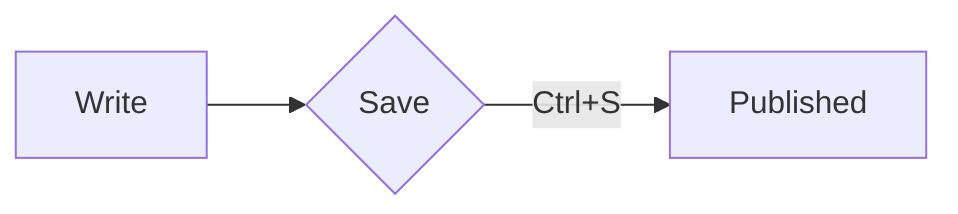

# Editor Playground

Links: [[Start Here]], [[Glossary|the glossary]], [[Start Here#Who this is for]], [[Missing Note]] and [a site](https://obsidian.md).
Formatting: **bold**, *italic*, ~~struck~~, ==highlighted==, `inline code`, %%a hidden comment%% and $e^{i\pi}+1=0$.
Tags: #demo #nested/tag — money like $5 and $10 stays text. ^para-1

## Tasks
- [x] done task
- [ ] open task (click the box)
- [/] in progress
  - nested bullet
1. first
2. second

> [!tip] Tip title
> Callout body with **bold**.

> [!warning]
> No title here: the type becomes the title.

> A plain quote.

---

![[diagram.svg|260]]

```js
const answer = 42; // syntax highlighted
function hi(name) { return `hi ${name}`; }
```

$$
\int_0^1 x^2 \, dx = \frac{1}{3}
$$



| Column | Other |
| --- | --- |
| a | [[Glossary]] |

## Try this
1. Click into any line: its Markdown appears; move away and it renders again.
2. Type `[[glo` and pick a note; type `[[Glossary#` for its headings, `[[Glossary#^` for block ids.
3. Type `#` and a letter for tags, or `/` at the start of a line for the slash menu.
4. Select a word and press **Ctrl+B**, or type `=` over it to highlight it.
5. Toggle **Live Preview / Source mode** in the status bar; **Ctrl+E** for the reading view.
