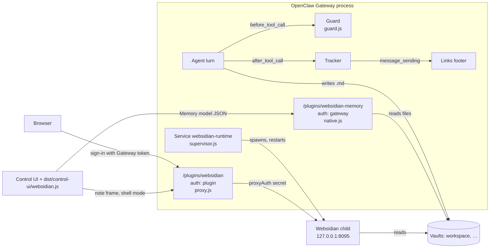

# OpenClaw plugin

Connects [OpenClaw](https://openclaw.ai) to Websidian the way the [[Hermes plugin]] connects Hermes: keeps agent-written vault notes plain Markdown, asks a human before the agent changes its own instruction files, replies with view/edit links for the notes it wrote, and serves the vaults behind the Gateway's own port.

> [!success] Status, 2026-09-23: works on OpenClaw 2026.9.5; the live chat turn is still outstanding
> Built against 2026.6.9 on 2026-09-17 (throw-away container, then `clawat02`), and checked again on **2026.9.5** in a local lab Gateway on 2026-09-21 and 2026-09-23: it loads, registers both routes, and the Memory page was browser-tested there — [[#The Memory page]]. The hooks are still exercised with a fake plugin API only: no model has run with the plugin, so "the agent's reply carries links" and "changing `SOUL.md` prompts for approval" are unit-tested contracts, not a live chat — [[#Is it really installed?]] rows 6 and 7.
>
> **`clawat02`** (pages at `http://127.0.0.1:18794/plugins/websidian/`) is up on 2026.9.5 but still runs the **2026-09-17 plugin**: no Memory page, and 2026.9.5 asks for two things it did not need before — [[#On OpenClaw 2026.9.5]]. Re-run the container installer there to get the Memory page.

Code: `integrations/openclaw/websidian/` (`openclaw.plugin.json`, `index.js`, `lib/`, `dist/control-ui/`, `skills/websidian/SKILL.md`, `deploy/`, `test/`, `README.md`). Plain ESM JavaScript, no build step, no dependencies.

## In plain words

OpenClaw is an AI agent that keeps its memory and notes as Markdown files in a folder (its *workspace*). This plugin does three jobs for it:

1. **Keeps the agent honest while it writes.** Before OpenClaw writes a file, the plugin looks at it. Notes must stay plain Markdown (no hidden scripts). If the agent tries to rewrite its own personality or rules files (`SOUL.md`, `AGENTS.md`, …), a human is asked first.
2. **Makes the notes readable in a browser.** The plugin starts a private Websidian server next to OpenClaw and shows the folders as a website, behind OpenClaw's own login. After the agent writes notes, its reply ends with links to them.
3. **Adds a 🧠 Memory page inside OpenClaw.** A new entry in OpenClaw's sidebar shows what the agent remembers — its long-term memory files, a day-by-day timeline, a note browser, a graph and search — without leaving OpenClaw or signing in again.

## How it fits together

Two pieces, installed side by side from the same revision of this repository:

- **The plugin** (`integrations/openclaw/websidian/`) — loaded *inside* the OpenClaw Gateway process. Hooks, a tool, a command, two HTTP routes, a background service, and a browser script for the Control UI.
- **The Websidian runtime** (a copy of `src/`, `public/`, `package.json` with its `node_modules`) at `<state dir>/plugin-data/websidian/app` — started by the plugin as a **child process** on `127.0.0.1:8095`. It is never exposed directly; every browser request goes through the Gateway.



| Moment | What happens |
|---|---|
| **Gateway starts** | OpenClaw loads `index.js` → `lib/plugin.js` registers everything. The `websidian-runtime` service writes `websidian.config.json` and `secrets.json` (mode `0600`) into `<state dir>/plugin-data/websidian/`, then spawns the runtime and restarts it if it dies. |
| **Agent writes a note** | `before_tool_call` runs the guard: allow, ask a human (`requireApproval`), or block. `after_tool_call` remembers the path; `message_sending` appends *Notes updated:* with links. |
| **Someone opens `/plugins/websidian/`** | The plugin's own sign-in (the Gateway token) sets a cookie; the proxy forwards to the runtime with a shared secret. Sites are `untrusted` (agent HTML inert) and read-only unless `edit: true`. |
| **Someone clicks 🧠 Memory** | OpenClaw has already authenticated them. The browser script draws the page; it asks `/plugins/websidian-memory/memory.json` for the model, which also mints the proxy cookie, so the note pane (Websidian in shell mode) opens with no second sign-in. |

Where things live after install (native: `~/.openclaw`; Docker: `/home/node/.openclaw`):

```
<state dir>/plugin-data/websidian/
  plugin/                 the plugin OpenClaw loads (plus websidian.version)
  app/                    the Websidian runtime and its node_modules (plus websidian.version)
  websidian.config.json   generated on every start from plugins.entries.websidian.config
  secrets.json            proxy / edit / session secrets, generated once
  cache/, server.log, server.pid   render cache, the runtime's log and PID
```

## What it does

| Surface | OpenClaw hook / API | Behaviour |
|---|---|---|
| Write guard | `before_tool_call` on `write`, `edit`, `apply_patch`, `exec` | Instruction files (`SKILL.md`, `SOUL.md`, `AGENTS.md`, `MEMORY.md`, `USER.md`, `TOOLS.md`, `IDENTITY.md`, `HEARTBEAT.md`, `BOOTSTRAP.md`) under `~/.openclaw`, an agent workspace or a vault → `requireApproval` (OpenClaw's plugin approvals: chat buttons or `/approve`), or `block` in `protectMode: "block"`. Vault writes with `<script>`, frames, `on…=` handlers, `javascript:`/`data:text/html` URLs, or `.html`/`.svg`/`.js` files → blocked. `exec` commands that write near a protected name or into a vault → approval. |
| Links | `after_tool_call` + `message_sending` | Notes written this session get a *Notes updated:* footer with view (and, for `edit: true` vaults, edit) links, unless the reply already carries them. |
| Tool | `websidian_links` | Links for given paths, or every note changed this session. |
| Command | `/brain [query]` | Ten most recently modified notes with links, and the pages URL. |
| Prompt | `before_prompt_build` | A short *Websidian vaults* section pointing at the vaults and the `websidian` skill. |
| Skill | `skills/websidian/SKILL.md` | How to write notes as Obsidian Markdown, RTL guidance, share links. |
| Pages | service `websidian-runtime` + route `/plugins/websidian` (`auth: "plugin"`) | A supervised Websidian on `127.0.0.1:8095` (config generated from the vaults, `proxyAuth`, sites `untrusted`, read-only unless `edit: true`), proxied at `/plugins/websidian/w/<slug>/…` behind a sign-in with the Gateway token. |
| Memory page | route `/plugins/websidian-memory` (`auth: "gateway"`) + a `surface: "tab"` descriptor + `dist/control-ui/` | A **🧠 Memory** destination in OpenClaw's own sidebar, opening inside the Control UI — [[#The Memory page]]. |

The guard is a port of the Hermes one: the active-content detector was checked against the Python reference on 140 inputs (44 real notes from this vault and the demo, 96 crafted attacks) with zero differences.

> [!danger] Two bypasses lived in the adapters around that detector until 2026-09-20
> Both are fixed and tested; both are worth knowing if you port this guard anywhere else.
> - **A file that does not exist yet was judged by its literal spelling.** `fs.realpathSync` throws unless the whole path exists, so the old fallback left every parent symlink unresolved — and a created file never exists. A junction into a protected folder was allowed. Path resolution now walks up to the deepest existing ancestor, matching `os.path.realpath`.
> - **A payload split across two edits passed.** The whole-file simulation only ran when every `oldText` was present in the original, so one decoy edit dropped the check to each `newText` alone, where `<scr` and `ipt>…</script>` look clean. The simulation now follows the text as it evolves, and when it cannot run the edits are scanned joined as well as apart.

## Install

Two copies, from the same revision: the **plugin** and the **Websidian runtime** (`src/`, `public/`, `package.json`, lock file, with `node_modules` installed inside it) at `<state dir>/plugin-data/websidian/app`.

**Docker container** (e.g. `alpine/openclaw`), from the repository root:

```bash
bash integrations/openclaw/websidian/deploy/install-into-container.sh <container> [--register]
```

**Native profile** (macOS, Linux, Git Bash) / **Windows PowerShell**:

```bash
bash integrations/openclaw/websidian/deploy/install-local.sh
```

```powershell
powershell -ExecutionPolicy Bypass -File integrations\openclaw\websidian\deploy\install-local.ps1
```

Each installer copies both parts, runs `npm ci --omit=dev` **inside the runtime copy** (never in your checkout), stamps both with the git revision, boots the runtime once on a throw-away vault and asks it for `/_health`. None of them edits `openclaw.json` or restarts the Gateway; they print those commands:

```bash
openclaw plugins install --link <state dir>/plugin-data/websidian/plugin
openclaw gateway restart      # Docker: docker restart <container>
```

### On OpenClaw 2026.9.5

Three settings the plugin did not need on 2026.6.9, all seen in `openclaw plugins inspect websidian --runtime`:

| What `inspect` says | Do | Without it |
|---|---|---|
| *requires capability consent* | `openclaw plugins enable websidian --accept-capabilities` (once) | OpenClaw keeps asking; seen on `clawat02` 2026-09-23 |
| *typed hook "before_prompt_build" blocked because non-bundled plugins must set … allowConversationAccess* | `plugins.entries.websidian.hooks.allowConversationAccess: true` | The *Websidian vaults* section never reaches the system prompt; the guard, links, tool and `/brain` are unaffected |
| *(nothing — the sidebar entry is simply missing)* | `gateway.controlUi.experimental.customPlugins: true`, or *Settings → Labs → Custom plugin UI* | No **Memory** in the sidebar |

Then restart the Gateway. It needs Node 24.16+ or 26.1+; it refuses Node 25.

> [!tip] `plugins.load.paths` is the other way in
> Instead of `plugins install --link`, list the plugin folder under `plugins.load.paths` in `openclaw.json` and set `plugins.entries.websidian.enabled: true`. The live test used this route.

> [!warning] Learned the hard way, 2026-09-17
> - `docker cp` writes files as **root**; `npm ci` as `node` then fails with `EACCES`. The container installer chowns the data folder before and after copying.
> - Under **Git Bash**, `docker cp "dir/."` copies the directory itself (MSYS path rewriting), so `src/` landed in `app/app/`. The installer now streams both copies in with `tar`, receiving through `sh -c` so the container path is not rewritten either. The smoke test is what caught both.

## Installing it for someone else

What another person needs: a running OpenClaw (**2026.9.5** tested; Node 24.16+ or 26.1+ for the Gateway), `git`, `npm`, and Bash (macOS, Linux, Git Bash) or PowerShell (Windows). Docker only if their OpenClaw runs in a container.

> [!warning] The repository is private (checked 2026-09-23)
> `github.com/satabd/Websidian` is private, so `git clone` works only for people you add as collaborators. The ways to hand it over are listed under [[#Ways to distribute it]]; pick one before sending the steps below.

**Step by step, for them:**

1. **Get the code**: `git clone https://github.com/satabd/Websidian.git` and `cd Websidian` (or unpack the archive you sent).
2. **Run the installer** for their setup — native: `bash integrations/openclaw/websidian/deploy/install-local.sh` (Windows: the `.ps1`); Docker: `bash integrations/openclaw/websidian/deploy/install-into-container.sh <container>`. It copies both pieces into their OpenClaw state dir, installs dependencies, and checks the runtime boots.
3. **Register the plugin** with the command it prints: `openclaw plugins install --link <state dir>/plugin-data/websidian/plugin` (Docker: add `--register` to step 2 instead).
4. **Consent**: `openclaw plugins enable websidian --accept-capabilities`.
5. **Configure** in `openclaw.json` — at least one vault, usually their workspace; the smallest useful block:
   ```json5
   {
     plugins: { entries: { websidian: {
       enabled: true,
       hooks: { allowConversationAccess: true },
       config: { vaults: [ { path: "~/.openclaw/workspace", slug: "workspace" } ] }   // ~ is expanded
     } } },
     gateway: { controlUi: { experimental: { customPlugins: true } } }
   }
   ```
   Docker: use the path inside the container, `/home/node/.openclaw/workspace`. If they reach the Gateway by anything other than `127.0.0.1:18789`, set `ui.publicBase` so links work.
6. **Restart the Gateway** (`openclaw gateway restart`, or `docker restart <container>`), then reload the Control UI.
7. **Check**: `openclaw plugins inspect websidian --runtime` shows 4 hooks, the tool, `/brain`, the service and 2 routes; **🧠 Memory** is in the sidebar; `http://127.0.0.1:18789/plugins/websidian/` asks for the Gateway token. The full list is [[#Is it really installed?]].

To update later: `git pull`, re-run step 2, restart (step 6).

### Ways to distribute it

| Way | What they do | Trade-off |
|---|---|---|
| **Add them as collaborators** on the private repo | Steps above as written | Simplest today; they see the whole project |
| **Make the repository public** | Steps above as written | Your call — nothing in the repo is meant to be secret, but review before flipping it |
| **Send an archive** (`git archive --format=zip -o websidian.zip HEAD`) | Unzip, then steps 2–7 | No git needed; the version stamp reads `unknown`, and updates mean a new archive |
| **npm / ClawHub package** (`openclaw plugins install <package>`) | Not available yet | The plugin alone packs cleanly (`npm pack` in the plugin folder), but it still needs the runtime copy that only the installers make — backlog [[Improvements backlog|A12]] |
 → `plugins.entries.websidian.config` (the manifest schema is strict: unknown keys fail config validation):

```json5
{
  plugins: { entries: { websidian: { enabled: true, config: {
    vaults: [
      { path: "/home/node/.openclaw/workspace", slug: "workspace" },
      { path: "/srv/brain", slug: "brain", title: "Second brain", edit: true },
      { path: "/srv/team", url: "https://notes.example.com/team/" }   // an external Websidian; links go there
    ],
    protectMode: "approve",        // or "block"
    // protect: [...], blockActiveContent: true, appendLinks: true,
    ui: { enabled: true, port: 8095, publicBase: "http://127.0.0.1:18789", auth: "gateway",
          memory: { vault: "workspace", label: "Memory" } }
  }, hooks: { allowConversationAccess: true } } } },
  gateway: { controlUi: { experimental: { customPlugins: true } } }   // the Memory page
}
```

| Key | Meaning |
|---|---|
| `vaults[].path` | Vault folder as the Gateway process sees it (inside the container for Docker). Never the whole state dir. |
| `vaults[].edit` / `untrusted` | Defaults `false` / `true`: browser editing is opt-in per vault; agent-written HTML stays inert. |
| `vaults[].url` | An external Websidian site base; the plugin then links there and does not serve that vault itself. |
| `protect`, `protectMode` | Basename globs of instruction files; `approve` (default) or `block`. |
| `ui.publicBase` | How browsers reach the Gateway; used in every link. Default `http://127.0.0.1:<gateway.port>`. |
| `ui.auth` | `gateway` (sign in with the Gateway token or password, default) or `password` + `ui.password`. |
| `ui.enabled: false` | Guard and links only; no Websidian process, no route. |
| `ui.memory.vault` | Slug of the vault the Memory page reads. Default: the first vault the plugin serves itself. |
| `ui.memory.label`, `icon`, `order` | The sidebar entry: default `Memory`, `brain`, `20`. |
| `ui.memory.enabled: false` | No Memory route, no sidebar entry; everything else unchanged. |

## Pages

`http://<gateway>/plugins/websidian/` → sign-in (Gateway token) → status page listing the sites → `/plugins/websidian/w/<slug>/<Note>`; the editor at `…/w/<slug>/_edit/<Note>` for `edit: true` vaults. The sign-in sets an `HttpOnly; SameSite=Lax` cookie scoped to `/plugins/websidian` for `ui.sessionHours` (12); failed sign-ins are rate-limited per address. The sign-in and sign-out forms carry a nonce matched against a `SameSite=Lax` cookie (`websidian_csrf`), because the Gateway's `Referrer-Policy: no-referrer` makes browsers send `Origin: null` on same-origin posts — an Origin check alone refuses every real browser (found on the first real sign-in, 2026-09-17). The proxy forwards an allowlist of headers, adds the `proxyAuth` secret, never passes Websidian's `Set-Cookie` through, and refuses dot segments and encoded slashes before they reach Websidian. When Websidian is down the pages answer `502` with the log tail and the supervisor is nudged.

## The Memory page

![[openclaw-memory.png]]

A **🧠 Memory** entry in OpenClaw's own sidebar — beside Home, Agents and Plugins — that opens *inside* the Control UI. The operator never leaves OpenClaw and never signs in twice.

| Tab | Shows |
|---|---|
| **Overview** | A card each for `MEMORY.md` (long-term), `USER.md` (what it learned about you) and `DREAMS.md` (consolidation): its first lines, when it changed ("2 hours ago") and how long it is. A file the workspace does not have yet is shown dashed and named, not hidden. Below, the eight most recent dated notes with their first heading and a two-line preview. |
| **Timeline** | Every dated note under `memory/` — including OpenClaw's own dreaming output under `memory/dreaming/` — grouped by day. *Today* and *Yesterday* are the reader's, worked out in the browser, not the Gateway's (which is usually another machine, in UTC). |
| **Browse** | The vault's note tree beside the note, for wandering. |
| **Graph** | Websidian's graph of the workspace; clicking a node opens that note in the reading pane. |

**Search** sits in the header on every tab (`/` focuses it, arrows and Enter pick a result, Esc clears). It queries Websidian's own index and shows the hits natively, with the matched words marked.

**Reading a note** — a card, a row or a search hit — turns the content area into a reading pane: a native bar with *Back*, the note's title and path, *Graph* (this note in the graph) and *Open* (the full page in a new tab), over Websidian in [[Embedding in your website#Inside another application shell mode|shell mode]] with `chrome=none`: the note, its table of contents, backlinks and local graph, and no second toolbar, search box or note tree. Links followed inside it update the bar.

The page reads OpenClaw's theme off the surface it is painted on and hands it down, so light and dark follow the host, live. It refreshes itself when you come back to the tab and once a minute on Overview and Timeline, and remembers the view and the open note for the browser tab, so a reload lands where you were.

> [!note] Why the view is not in the URL
> OpenClaw highlights a sidebar entry only when the page's parameters match it exactly, so writing `?p.view=…` into the address bar turned **Memory** grey in the sidebar after a reload. The view is kept in `sessionStorage` instead; a link that does carry `p.view` / `p.note` is still honoured.

> [!tip] Nothing an agent wrote is ever markup in the Control UI
> The page runs with the operator's authority, so titles, previews and search snippets are built as text — a snippet's `<mark>` is rebuilt as an element and everything else in it is dropped — and a frame only ever points at a same-origin path from the plugin's own model.


**Turn it on.** *Settings → Labs → Custom plugin UI*, or `gateway.controlUi.experimental.customPlugins: true` in `openclaw.json`; then restart the Gateway and reload the page. Without it the backend still registers the route and the descriptor, and everything else in the plugin works unchanged. `ui.memory.enabled: false` removes the sidebar entry entirely.

**Two halves, either of which stands alone.** The backend registers `/plugins/websidian-memory` (`auth: "gateway"`) and a `surface: "tab"` Control UI descriptor pointing at it. A host that renders the tab but has no native view frames that route, which serves the same dashboard as plain HTML. The browser half — `dist/control-ui/websidian.js`, loaded by the Control UI — registers a native page under the same id, `memory`, and draws the dashboard itself.

> [!note] One sign-in, not two
> The Memory route only ever answers a request OpenClaw has already authenticated, so it mints the plugin's own session cookie for that browser: the same signed, `HttpOnly`, path-scoped cookie a successful sign-in on the form mints. The notes it links to then open through the existing proxy — no second sign-in, no new kind of credential, and the stand-alone pages keep their own sign-in untouched. This is [[Decisions|the 2026-09-16 decision]] about one dashboard login, applied to OpenClaw's login.

> [!warning] Why `/plugins/websidian-memory` and not `/plugins/websidian/memory`
> OpenClaw refuses two plugin routes whose prefixes overlap — *"http route overlap rejected"*, which is exactly what the first version got — and the stand-alone prefix route already claims everything below it. The two surfaces are siblings. The session cookie stays scoped to `/plugins/websidian`, so it reaches the proxy and never travels to the Memory route.

**Read-only, and no wider than the vault.** The Memory page never offers the editor, whatever `edit` a vault is given elsewhere. What it hands the browser is vault-relative paths only — never a filesystem path, never anything outside the configured vault, never the state directory.

**Agents.** One vault today, named by `ui.memory.vault` (default: the first vault the plugin serves itself). The page already reads `host.agents.selectedId` and shows it in the subtitle; per-agent workspaces plug in at `memoryVault()` and that one setting — [[Improvements backlog|A16]].

## Is it really installed?

| # | Check | 2026.6.9, container, 2026-09-17 | 2026.9.5, lab Gateway, 2026-09-21/23 |
|---|---|---|---|
| 1 | `openclaw plugins inspect websidian --runtime`: typed hooks, tool `websidian_links`, command `brain`, service `websidian-runtime`, **2** HTTP routes, no diagnostics beyond the trust note | ✅ 4 hooks, 1 route (before the Memory page) | ✅ 2 routes; 3 hooks until `allowConversationAccess` is set, then 4 |
| 2 | `<appDir>/src/server.js` and `node_modules/` exist; the installer's smoke test passed | ✅ | ✅ (runtime pointed at the checkout) |
| 3 | `GET /plugins/websidian/` without a session → `302` to the sign-in; a wrong secret → `401`; a tampered cookie → `302` | ✅ | ✅ `302` |
| 4 | Signed in: `status.json` says `running: true` and lists the sites | ✅ `running: true, pid 210`, sites `brain`, `workspace` | ✅ |
| 5 | A proxied note answers `200` with a CSP and `nosniff`, no `Set-Cookie` | ✅ also: editor `200` on the `edit: true` vault, `404` on the read-only one; dot segments `404`; the Control UI root still answers | ✅ |
| 6 | A reply after writing a note ends with *Notes updated:* and a working link | unit-tested contract only | unit-tested contract only |
| 7 | Changing `SOUL.md` produces an approval prompt | unit-tested contract only | unit-tested contract only |
| 8 | `/plugins/websidian-memory/memory.json`: `401` without Gateway auth, `200` with it, and a `websidian_session` cookie that opens the proxied notes | — | ✅ |
| 9 | **Memory** in the Control UI sidebar, highlighted when open; every tab, search and the reading pane work, light and dark | — | ✅ |

## Updating

Re-run the installer, then restart the Gateway (it owns the supervised Websidian process, so the restart replaces both). The status page flags a **version skew** when the runtime and plugin stamps differ.

## Tests

`npm test` at the repository root runs the plugin suite too (`integrations/openclaw/websidian/test/`, 98 tests): the guard, links and slugs, the runtime config and secrets, the proxy rules, the sign-in route over a real HTTP server, the Memory model and its route, the browser Control UI plugin against the Gateway's own asset rules, and `register()` against a fake plugin API whose contracts were read from OpenClaw 2026.6.9 and 2026.9.5 — [[Testing]].
