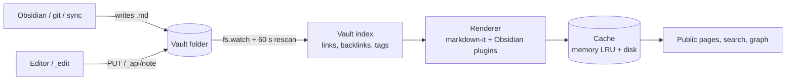

# Architecture

One Node process, no database, no build step ([[Decisions]]).



## Request for a page
1. `stat()` the `.md` → stamp = mtime + size.
2. Browser's ETag matches → `304`, no body.
3. Memory cache, then disk cache, keyed on stamp + vault file list + renderer version.
4. Miss → render (2–15 ms), store, wrap in the layout.

A page re-renders only when its file changes, a note it embeds changes, or notes are added/removed/renamed. At start every visible note is rendered in the background.

## Source files
| File | Does |
|---|---|
| `src/server.js` | Routing, HTTP caching, search, warm-up |
| `src/vault.js` | Index, wikilink resolution, tags, watching |
| `src/render.js` | markdown-it and Obsidian syntax |
| `src/layout.js` | Page shell: sidebar, breadcrumbs, TOC, chips |
| `src/cache.js` | Memory + disk render cache |
| `src/auth.js`, `src/ratelimit.js` | Site auth, rate limits |
| `src/search.js` | MiniSearch index |
| `src/bases.js` | Obsidian Bases |
| `src/sections.js` | Folder pages and generated section lists |
| `src/graph.js` | Graph data |
| `src/seo.js` | Sitemap, robots, OpenGraph |
| `src/hooks.js` | Purge and git webhook |
| `src/proxyauth.js` | Sign-in through a trusted reverse proxy (`proxyAuth`) |
| `src/untrusted.js` | CSP, attachment allowlist for `untrusted` sites |
| `src/excalidraw.js` | Excalidraw: the plugin's file format (LZ-String, `## Drawing`, `## Embedded Files`), the safe scene JSON, the viewer markup |
| `public/excalidraw-view.js` | Loads Excalidraw + React from `/_vendor` on demand and mounts the viewer — [[Excalidraw drawings]] |
| `src/editor.js` | Editor login, sessions, IP gate, API, vault settings |
| `src/esm.js` | Serves CodeMirror modules and the import map |
| `public/editor.js`, `public/editor.css` | Editor page shell |
| `public/cm/` | The CodeMirror editor — [[Editor internals]] |
| `public/graph*.js`, `public/explore.js` | Graph views |
| `test/` | [[Testing]] |
| `demo/` | Practice vault and config for `npm run demo` |
| `docs/` | This vault |

## Agent integrations

The agent plugins run Websidian *next to* the agent rather than inside it: the [[OpenClaw plugin]] starts it as a child process of the OpenClaw Gateway on loopback and proxies it behind the Gateway's login (diagram in [[OpenClaw plugin#How it fits together]]); the [[Hermes plugin]] does the same job for Hermes.

## Where this is going

The same shape, with the pieces [[Roadmap]] adds — git as the history engine, an MCP endpoint for agents, per-site themes:

```
                 ┌──────────────── one Node process ─────────────────┐
  Obsidian ──sync──▶ vault/ (files) ──watch──▶ Vault index ──▶ Renderer ──▶ Cache ──▶ Public site  /site/...
  git / Dropbox      .obsidian/ settings        (links,        (markdown-it   (mem +      Embeds      ?embed=1
                     .git/ history              backlinks,      + Obsidian     disk)      Search      /_search
                                                tags, props)    plugins)                  Graph       /_graph
                                                    ▲                                     Sitemap
                                                    │ write + commit
                                     Editor  /site/_edit  ◀── login, roles, IP gate
                                     API     /site/_api   ◀── sessions / bearer token ◀── agents (MCP)
```

Nothing in it needs a database: every box is a file read, a file write or an in-memory index rebuilt from files — [[Scope and positioning#The CMS half]].
