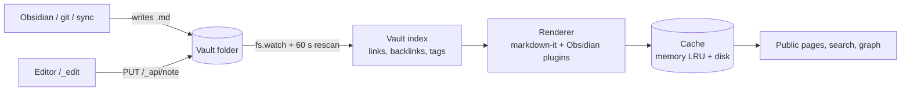

# Architecture

One Node process, no database, no build step ([[Decisions]]).

## Request for a page
1. `stat()` the `.md` → stamp = mtime + size.
2. Browser's ETag matches → `304`, no body.
3. Memory cache, then disk cache, keyed on stamp + vault file list + renderer version.
4. Miss → render (2–15 ms), store, wrap in the layout.

A page re-renders only when its file changes, a note it embeds changes, or notes are added/removed/renamed. At start every visible note is rendered in the background.

## Source files
| File | Does |
|---|---|
| `src/server.js` | Routing, HTTP caching, search, warm-up |
| `src/vault.js` | Index, wikilink resolution, tags, watching |
| `src/render.js` | markdown-it and Obsidian syntax |
| `src/layout.js` | Page shell: sidebar, breadcrumbs, TOC, chips |
| `src/cache.js` | Memory + disk render cache |
| `src/auth.js`, `src/ratelimit.js` | Site auth, rate limits |
| `src/search.js` | MiniSearch index |
| `src/bases.js` | Obsidian Bases |
| `src/graph.js` | Graph data |
| `src/seo.js` | Sitemap, robots, OpenGraph |
| `src/hooks.js` | Purge and git webhook |
| `src/proxyauth.js` | Sign-in through a trusted reverse proxy (`proxyAuth`) |
| `src/untrusted.js` | CSP, attachment allowlist for `untrusted` sites |
| `src/editor.js` | Editor login, sessions, IP gate, API, vault settings |
| `src/esm.js` | Serves CodeMirror modules and the import map |
| `public/editor.js`, `public/editor.css` | Editor page shell |
| `public/cm/` | The CodeMirror editor — [[Editor internals]] |
| `public/graph*.js`, `public/explore.js` | Graph views |
| `test/` | [[Testing]] |
| `demo/` | Practice vault and config for `npm run demo` |
| `docs/` | This vault |
